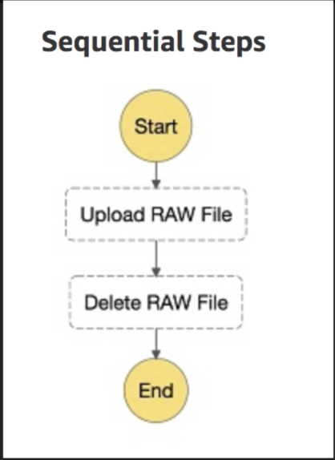
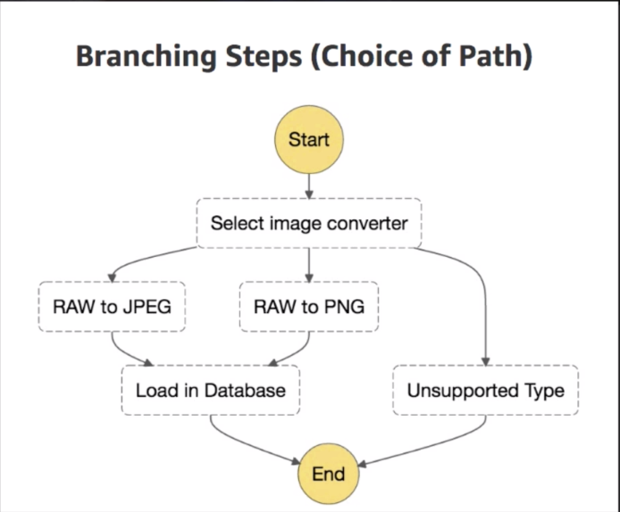
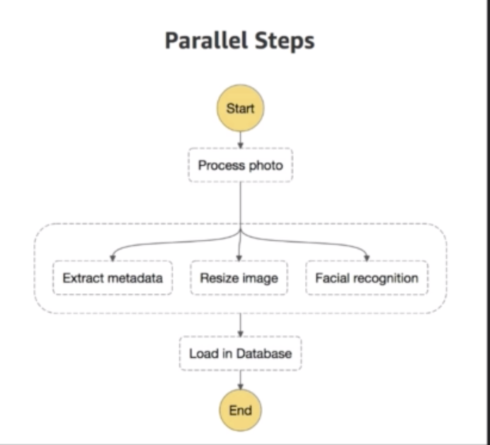

#Serverless

## Lambda

### Layers of Extraction
* Data Centres
* Hardware
* Assembly Code/Protocols
* High level languages
* Operating Systems
* Application Layer/AWS APIs
* AWS Lambda

### What is it?
_A compute service where you can upload your code and create Lambda functions, and takes care of provisioning and managing the servers that you use to run the code_

Can be used in the following ways:
  * Event-driven compute service - AWS Lambda runs your code in response to events
  * Compute service to run code in response to HTTP requests using Amazon API Gateway or API calls made using AWS SDKs

### Which languages are supported?
* Node.js
* Java
* Python
* C#
* Go

### Pricing
* Num of requests: First 1 million requests free, $0.20/million after
* Duration: calculated from time code begins executing until it returns. Price depends on amount of memory allocated to your function. $0.00001667 for every GB-second used

### Positives
* No servers
* Scales out (not up) automatically
  * Can have functions running in parallel at the same time
* Lambda functions are independent, 1 event = 1 function
  * But lambda functions can trigger other lambda functions so really 1 evemt can = x functions if functions trigger other functions
* Inexpensive

### Exam Tips
* Use AWS X-Ray to debug Lambda
* Other services that are Serverless: DynamoDB, S3, API Gateway
* RDS and EC2 are **not** Serverless
* Can use it across regions

## API Gateway

### Types of APIs
* **REST APIs** (Representational State Transfer)
  * Uses JSON
* **SOAP APIs** (Simple Object Access Protocol)
  * Uses XML

_API Gateway runs on RESTful APIs.  It is a fully managed service that makes it easy for developers to publish, maintain, monitor, and secure APIs at any scale._

### What can API Gateway do?
* Expose HTTPS endpoints to define a RESTful API (gives HTTPS address that we can make calls to)
* Serverless-ly connect to services like Lambda & DynamoDB
* Send each API endpoint to a different target
* Efficient and inexpensive
* Scales automatically
* Track and control usage by API key
* Throttle requests to prevent attacks
* Connect to CloudWatch to log all requests for monitoring
* Maintain multiple versions of your API

### How do I configure API Gateway?
* Define an API (container)
* Define resources and nested resources (URL paths)
* For each resource...
  * Select supported HTTP methods (GET, DELETE etc)
  * Set security
  * Choose target
  * Set request and response transformations
* Deploy API to a stage
  * Uses API Gateway domain by default but can use custom domain

### API Caching
Can enable API caching in API Gateway to cache your endpoint's response. This can reduce the number of calls made to your endpoint and improve latency of the requests to your API

When caching enabled for a stage, API Gateway caches responses from your endpoint for a specified time-to-live period in seconds.

Gateway then responds to the request by looking up the endpoint response from the cache instead of making a request to your endpoint

### Same Origin Policy
Under the policy, a web browser permits scripts contained in a first web page to page to access data in a second web page, but only if both have the same origin. This is done to prevent Cross-Site Scripting (XSS) attacks

_This is enforced by web browsers but is ignored by tools like PostMan and curl_

### CORS (Cross Origin Resource Sharing)
A mechanism that allows restricted resources on a web page to be requested from another domain outside the domain from which the first resource was served. Enforced by the client

_This is a way for API Gateway to talk to S3_

* Browser makes an HTTP OPTIONS call (GET, POST etc) for a URL
* Server returns a response
* Example of an error can be: _"Origin policy cannot be read at the remote resoure"._ You need to enable CORS on API Gateway
  * If you are using Javascript/AJAX that uses multiple domains with API Gateway, need to enable

## Lab
1. Create S3 bucket
  - Go to properties in S3 and enable static web hosting
  - Type in index document and error document
2. Go to Route53 and register domain (needs to be same name as S3 bucket)
3. Configure Lambda function
  - Can create from 3 different ways (from scratch, from preconfigured templates, or from repos built by other developers)
  - Fill in fields: name, runtime, role, policy template (use simple microservice permissions)
  - Write function in Lambda window
  - Configure triggers (for exam, memorize triggers!): add API Gateway -> create new API
4. Configure API Gateway
  - Create action method (integration type: Lambda function)
5. Deploy API
  - Can click on 'invoke API' to get response
6. Use API Gateway URL in your code
7. Go to S3 and add files to your bucket (index.html, error.html), go to Route53 and create record set and set alias to Yes

## Version Control with Lambda

### Versioning
* When using versioning, can publish one or more versions of your Lambda function
* Each Lambda function version has a unique ARN (Amazon Resource Name)
* After you publish a version, it cannot be changed
* Latest code is **$LATEST** version

### Qualified/Unqualified ARNs
* **Qualified ARN:** The function ARN with the version suffix, uses $latest
* **Unqualified ARN:** The function ARN without the version suffix

### Alias
* Name that maps to a specific version of your function
* Can split traffic using aliases to differents, but cannot split traffic with $latest.  Instead, create an alias to latest

## Step functions
* provides a graphical console to arrange and visualize the components of your application as a series of steps
* automatically triggers and tracks each step, logs the state of each step, and retries when there are errors

_for the exam, just need to know what step functions are (no need for different types)_

## X-Ray
* A service that collects data about requests that your application serves, and provides tools you can use to view, filter, and gain insights into that data to identify issues and opportunities for optimization
* Can also see info about calls that your app makes to downstream AWS resources, microservices, DBs and HTTP web APIs

### Architecture
X-Ray SDK sends JSON to X-Ray Daemon which then sends to X-Ray API

X-Ray API stores data and creates X-Ray visualization (console)

### X-Ray SDK provides...
* Interceptors to add your code to trace incoming HTTP Requests
* Client handlers to instrument AWS SDK clients tht your application uses to call other AWS services
* An HTTP client to use to instrument calls to other internal and external web services

### Integration with other AWS services
* Elastic Load Balancer
* AWS Lambda
* API Gateway
* EC2
* Elastic Beanstalk

### Languages
Supports Java, Go, Node.js, Python, Ruby, .Net

## Advanced APIn Gateway

### Import APIs
* Can use *API Gateway Import* feature to import an API from an external definition file into API Gateway
* Currently this feature supports *Swagger v2.0* definition files
* Can either create a new API by submitting a POST request that includes a Swagger definition in the payload and endpoint configuration, or can update an existing API by using a PUT request
  * Can update an API by overwriting it with a new definition or merge a definition with an existing API
* Then specify the options using a mode query parameter in the request URL

### API Throttling (two ways of throttling)
* By default API Gateway limits the steady-state request rate to 10,000 requests/second
* Max # of concurrent requests is 5000 across all APIs within an AWS account
* If you go over 10,000 rps or 5000 concurrent requests you will receive a *429 Too Many Request* error

### SOAP Webservice Passthrough
* It is possible to configure API Gateway as a SOAP Webservice passthrough
