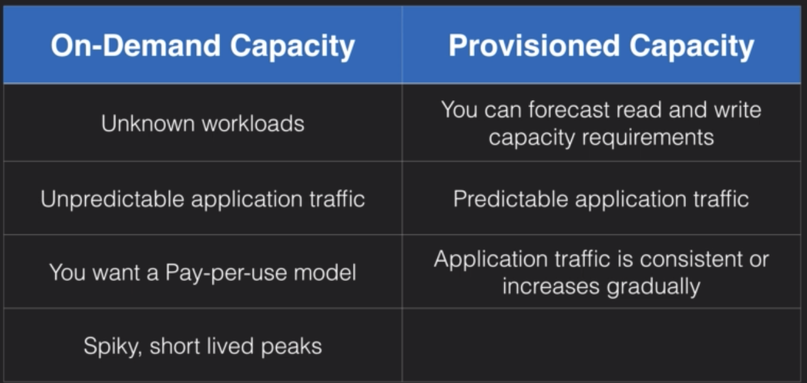
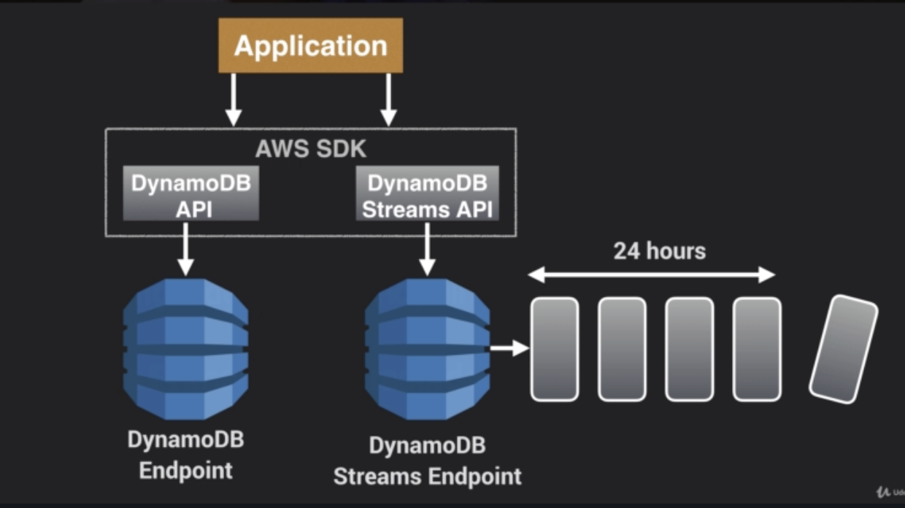

#DynamoDB

* A NoSQL DB service
* Serverless, fully-managed
* Supports both document and key-value data models
* Flexible (do not need to define schema upfront)
* Stored on SSD storage
* Spread across 3 geographically distinct data centers

* Choice of 2 consistency models:
  * Eventual Consistent Reads (default)
    - consistency across all copies of data is usually reached within a second
    - repeating a read after a short time should return the updated data
    - best read performance
  * Strongly Consistent Reads
    - returns a result that reflects all the writes that received a successful response prior to the read

* DynamoDB is made up of...
  * Tables
  * Items (row of data in table)
  * Attributes (column)
  * Supports key-value and document data structures
  * Documents can be written in JSON, HTML or XML

### Primary Keys (2 types)
* *Partition key* (unique attribute)
  - value is put into an internal hash function which determines the partition or physical location on which the data is Stored
  - if you are using the partition key as your primary key, no two items can have the same partition key
* *Composite key*
  - made up of _partition key_ + _sort key_
  - would use if partition key is not necessarily unique
  - all items with the same partition key are sorted together, then sorted according to the sort key value
  - allows you to store multiple items with the same partition key

### Access Control
* managed using IAM
* can create IAM role which enables you to obtain temporary access keys which can be used to access DynamoDB
* can also use *IAM condition* to restrict user access to only their own records (ex. allow access to only items where the partition key value matches user's user ID -> `dynamodb:LeadingKeys`)

## Lab

## Indexes
* 2 types of Index are supported to help speed-up your DynamoDB queries:
  * *Local Secondary Index*
    - can only be created when you're creating your table
    - cannot add, remove, or modify later
    - has same partition key as your original table, but different sort key
    - gives you a different view of your data organized according to an alternative sort key
    - any queries based on this sort key are much faster using the index than the main table
  * *Global Secondary Index*
    - more flexible, can create whenever
    - different partition key and different sort key, so gives a completely different view of the data
    - speeds up any queries relating to this alternative partition and sort key

## Scan vs Query Api Call
* *Query*: finds items in a table based on the Primary Key attribute and a distinct value to search for
  - use an optional sort key name and value to refine results
  - by default, a query returns all the attributes for the items but you can use the *ProjectionExpression* parameter if you want to only return specific attributes
  - results are always sorted by Sort Key
  - If numeric, sorted in ascending order by default
  - If ASCII characters also sorted by ascending order by default
  - can reverse order by setting *ScanIndexForward parameter* to _false_
  - by default, queries are Eventually Consistent
* *Scan*: examines every item in the table
  - returns all data attributes by default
  - can also use ProjectionExpression to return certain attributes
  - takes longer. On a large table, can use up the provisioned throughput in just a single operation

### How to improve performance
* Can set a smaller page size which uses fewer read operations (ex. set page size to return 40 items)
* larger number of smaller operations will allow other requests to succeed without throttling
* avoid using scan operations if you can
* can use *Parallel Scans* instead
  - by default, a scan operation processes data sequentially and returns in 1MB increments, can only scan one partition at a time.  Can instead divide table or index into segments and scan each segment in parallel (however, best to avoid parallel scans if your table or index is already incurring heavy read/write activity)

## DynamoDB Provisioned Throughput
* mechanism to define the capacity and performance requirements in DynamoDB

### Capacity units
* DPT is measured in Capacity units
* When you create your table, you need to specify your requirements in terms of Read CU and Write CU
* 1 x Write CU = 1 x 1KB Write per second
* 1 x Read CU = 1 x Strongly Consistent Read of 4KB per second **or** 2 x Eventually Consistent Reads of 4KB per second (default)

_*Example calculation 1*_
Your application needs to read 80 items per second and each item is 3KB in size, and you need Strongly Consistent Reads.

3KB / 4KB = 0.75
Round to nearest whole number, so 1 Read CU needed for each read operation

Multiple by number of reads per second
**1 x 80 = 80 Read CU required**

_For Eventually Consistent Reads, will need to divide 80 by 2 so only need 40 Read CU for Eventually Consistent reads_

_*Example calculation 2*_
You want to write 100 items per second, each item is 512 bytes in size.

512 bytes / 1KB = 0.5
Rounded up, each write will need 1 Write CU per write operation
*1 x 100 = 100 Write CU required*

## On-demand capacity pricing option
* Charges apply for reading, writing and storing data
* Don't need to specify your requirements, DynamoDB instantly scales up and down based on activity of your application
* Good for unpredictable workloads

## DynamoDB Accellorator (DAX)
* A fully managed, clustered in-memory cache for DynamoDB
* Up to 10x read performance improvement
* Good for read-heavy workloads and bursty workloads, ex. auction, gaming, and retail sites during sales/promotions
* only supports write-through caching strategy

### How does it work?
* Data is written to the cache as well as the back end store at the same time (write-through caching service)
* Allows you to point your DynamoDB API calls at the DAX cluster instead of your table
* If the item you are querying is in the cache (cache hit), DAX returns the result to the application
* If item is not available (cache miss), DAX performs an _eventually consistent_ GetItem operation against DynamoDB
* Retrieval of data from DAX reduces the read load on DynamoDB tables

### What is it not suitable for?
* Applications that require Strongly consistent reads
* Write intensive applications
* Applications that do not perform many read operations
* Applications that do not require microsecond response times

## Elasticache
### What is it?
* improves performance of web applications by allowing you to retrieve info from in-memory caches instead of disk based DBs
* sits between your application and the databases
* good if DB is read-heavy and data is not changing frequently

### Benefits
* Improves performance for read-heavy workloads
* frequently-accessed data is stored in memory for low-latency access
* good for compute heavy workloads (ex. recommendation engines)
* can be used to store results of I/O intensive DB queries or output of compute-intensive calculations

### 2 types
#### Memcached
* widely adopted memory object caching system
* multi-threaded
* no multi-az capacity

#### Redis
* open-source in-memory key-value store
* supports more complex data structures (sorted sets and lists)
* supports Master/Slave replication and multi-AZ

### 2 caching strategies available
#### Lazy Loading
* loads data into the cache only when necessary
* if data is not in cache or has expired, elasticache returns null. Your app then fetches data from DB and writes data received into the cache so it is available next time

**Advantages**
* Only requested data is cached: avoids filling cache with useless data
* Node failures are not fatal. If elasticache fails, a new node will just have a lot of cache misses initially

**Disadvantages**
* cache miss penalty: if you want to retrieve data not in the cache, will have to query DB instead
* stale data: if data is only updated when there is a cache miss, can become stale. Does not automatically update if data in DB changes

* To deal with stale data, can add **Time to Live (TTL)**, which specifies number of seconds until the key expires. Lazy loading treats an expired key as a cache miss, so will retrieve data from DB

#### Write-through
* adds or updtes data to cache whenever data is written to the DB

**advantages**
* data in cache never stale

**disadvantages**
* write-penalty: every write involves a write to the cache as well as a write to the DB
* if a node fails and new one spun up, data is missing until added or updated in the DB (can mitigate by using lazy loading in conjunction)
* wasted resources if most data is never read

## DynamoDB transactions
* to support mission-critical applications which need all or nothing approach to their DB transactions
* ACID transactions - describes ideal properties of a DB transaction
  * Atomic - transaction treated as a single unit
  * Consistent - must be a valid transaction
  * Isolated - no dependency between different transactions
  * Durable - once transaction has been committed it should stay committed, even after a system or power failure

## TTL
* defines an expiry time for your data, expired items are will be deleted within next 48 hours
* good for removing irrelevant or old data (ex. session data, event logs, temporary data)
* reduces cost by automatically removing data
* set in unix time

## Streams
* Time-ordered sequence of item level modifications (insert, update, delete)
* Actions are recorded as logs, which are encrypted at rest and stored for 24 hours
* Accessed using their own dedicated endpoint
* By default, Primary Key is recorded
* Can also capture state of item before and after change
* Good for serverless architectures
* Events are recorded in near real-time
* Can be used as an event source for Lambda so you can create applications which take actions based on events in your DynamoDB table

## Provisioned Throughput Exceeded Exception
* May see `ProvisionedThroughPutExceededException` if your request rate is too high for the read/write capacity provisioned on your table
* SDK automatically retries requests until successful
* If not using SDK, can reduce request frequency or use _exponential backoff_

##Exponential Backoff
* Progressively longer waits between consecutive retries of failed requests
* Improves flow control
* A feature of every AWS SDK (not just DynamoDB)
