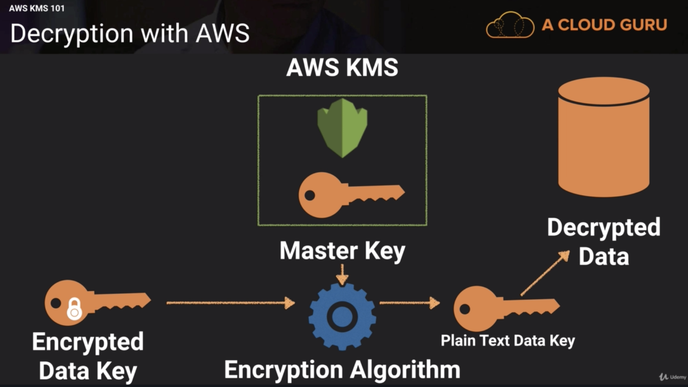

## KMS 101
### What is it?
* Key Management Service - a managed service that makes it easy for you to create and control the encryption keys used to encrypt your data
* Encryption keys are regional
* Uses multitenant hardware

### Customer Master Key consists of...
* alias (name)
* creation date
* description
* key state
* key material (either own key material or KMS generated)

_Can never export CMK_
* If you need to export your keys, need to use cloud HSM

### CMK set up
* create alias and description
* choose material optional
* define key **administrative permissions**
  * which user/role can administer (but not use) the key
* define key **usage permissions**
  * which user/role can use key to encrypt/decrypt data

## KMS API calls
* `aws kms encript`
* `aws kms decrypt`
* `aws kms re-encrypt` - will decrypt and re-encrypt it immediately and destroy plain text
* `aws kms enable-key-rotation`

## Envelope Encryption
* The process of encrypting your **envelope key** (ie. the key you use to encrypt your data)
* Envelope key sometimes called data key
* To unencrypt, take master key and do encryption algorithm on encrypted data key and turn into plain text, then use plain text data key to decrypt data

