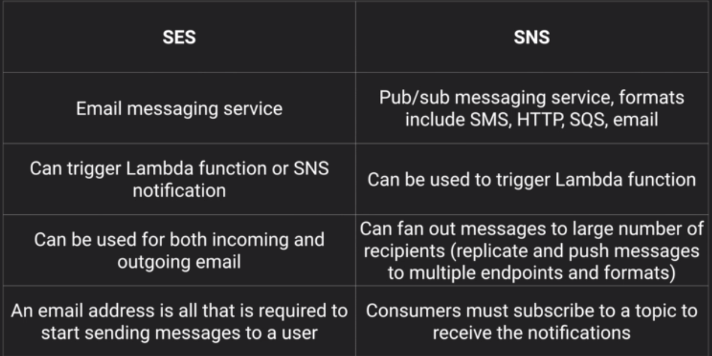

# Simple Queue Service (SQS)
### What is it?
* Service that gives you access to a message queue that can be used to store messages that are awaiting processing
* The first service on AWS platform
* A pull-base system (pulls messages(jobs) down)
* Using SQS, you can decouple the components of an app so they run independently for easier message management
* Messages can contain up tp 256 KB of text in any format
* messages can be kept in the queue from 1 minute to 14 days, default retention period is 4 days

### Two types of queues
**Standard Queue (default)**
* allows nearly unlimited number of transactions per second
* guarantees that a message is delivered at least once
* duplicates may occur
* best-effort ordering to ensure messages are generally delivered in the same order as they are sent

**FIFO**
* order in which messages are sent and received is strictly preserved
* a message is delivered once and remains available until a consumer processes and deletes it
* duplicates are not introduced into queue
* support message groups that allow multiple ordered message groups within a single queue
* limited to 300 transactions per second

### Visibility timeout
* the amount of time that the message is invisible in the SQS queue after a reader picks up that message
* if job is processed before visibility timeout expires, message is deleted from queue
* if job is not processed within that time, message will become visible again and another reader will process it
  * may result in message delivered twice
* Default is 30 seconds
  * Should increase this if your task takes >30 seconds
* Max is 12 hours

### Long Polling
* A way to retrieve messages from SQS queues
* Does not return a response until a message arrives in queue, or until long poll times out

Normally, with regular short polling (default), will continue pulling (asking if there's a job) even when message queue is empty

# Simple Notification Service
### What is it?
* A service that makes it easy to set up, operate, and send notifications from the cloud
* Can send push notifications to Apple, Google, Fire OS, and Windows mobile devices, and Android devices in China with Baidu Cloud Push
* Can also send notifications by SMS text or email to SQS queues, or to any HTTP endpoint
* Can trigger Lambda functions - lambda function receives the message payload as an input parameter and can manipulate the info in the message, publish the message to another SNS topic, or send message to other AWS services
* To prevent messages from being lost, all messages published to SNS are stored redundantly across multiple availability zones
* push-based
* publish-subscribe" model - users subscribe to topics

### Topics
* SNS allows you to group multiple recipients using topics (can support deliveries to multiple end points)

### Benefits
* instantaneous, pushed-based delivery (no polling)
* simple APIs and easy integration with applications
* flexible message delivery over multiple transport protocols
* inexpensive pay-as-you-go model

### Pricing
* $0.50 per 1 million SNS Requests
* $0.06 per 100,000 notification deliveries over HTTP
* $0.75 per 100 notification deliveries over SMS
* $2.00 per 100,000 notification deliveries over email

# Simple Email Service (SES)
* Email service designed to help you send marketing, notification, and transactional emails to your customers
* Pay as you go
* can also be used to receive email - incoming emails can be delivered automatically to an S3 bucket
* incoming mails can be used to trigger lambda functions and SNS notifications
* email only

### Use cases
* automated emails
* purchase confirmations, shipping mails, order status updates
* marketing communications, advertisements, newsletters, special offers

# Elastic Beanstalk
### What is it?
* A service for deploying and scaling web apps - Elastic Beanstalk will handle deployment, capacity provisioning, load balancing, auto-scaling and application health
* Fastest and simplest way to deploy your app in AWS
* You only pay for AWS resources required to store and run your applications
* automatically scales your app up and down
* Can manage EC2 instances for you or you can take full administrative control

## Updating Elastic Beanstalk
### EBS Deployment policies (important for exam!)
Elastic beanstalk supports several options for processing deployments:
* all at once
* rolling
* rolling with additional batch
* immutable

**All at Once**
* updates and deploys the new version to all instances simultaneously
* all of your instances are out of service while the deployment takes place
* will experience and outage while deployment is taking place
* if update fails, will need to roll back the changes by re-deploying the original version to all your instances

**Rolling**
* deploys new version in batches
* each batch of instances is taken out of service while deployment takes place
* your environment capacity will be reduced by the number of instances in a batch while deployment takes place
* not ideal for performance sensitive systems
* if update fails, need to perform an additional rolling update to roll back the changes

**Rolling with additional batch**
* launches an additional batch of instances
* deploys the new version in batches
* maintains full capacity during the deployment process
* if update fails, will need to perform an additional rolling update to roll back the changes
* good for when you cannot afford down time

**Immutable**
* deploys the new version to a fresh group of instances in their own autoscaling group
* when new instances pass their health checks, they are moved to your existing auto scaling group and the old instances are terminated
* maintains full capacity during deployment process
* rollback process requires only terminating the new auto scaling group
* preferred option for mission critical production systems

## Advanced ElasticBeanstalk
* Can customize your Elastic Beanstalk environment using Elastic Beanstalk configuration files
* Files written in YAML or JSON format
* Can have filename of your choice but must have `.config extension` and be saved inside a folder called `.ebextentions` that is in the top-level directory of your application

## RDS & Elastic beanstalk
### two ways to integrate with RDS database
* Launch RDS instance from within Elastic Beanstalk console
  * Quick and easy to get started
  * Suitable for test and dev environment only
  * Not ideal for production because lifecycle of your DB is tied to the lifecyrcle of your application environment. If you terminate the environment, the DB instance will be terminated too
* Launch outside of Elastic beanstalk, directly from the RDS section of the console
  * Additional configuration steps required
    - security group must be added to your environment's auto-scaling group
    - provide connection string configuration information to your application servers
  * Preferred option for production environment

## Kinesis
### What is streaming data?
* Data that is generated continuously by thousands of data sources, which typically send in the data records simultaneously, and in small sizes
  * ex. purchases from online store, stock prices, data from games, social network data, geospatial data

### What is kinesis?
* A platform you can send your streaming data to, makes it easy to load and analyze streaming data, and provides ability for you to build your own custom applications

### Core Kinesis services
_know this for exam_
**Kinesis streams**
* data producers (Ec2, mobile device, laptop) send data to kinesis streams
* data stored in shards
* stores data for 24 hours by default, can increase to 7 days retention
* total capacity of the stream is the sum of the capacities of its shards
* data consumers (like EC2 instances) pipe data from shards and does something with it, then send data to be stored by other AWS services (like DynamoDB, S3 etc)

**Kinesis firehose**
* data producers (Ec2, mobile device, laptop) send data to kinesis firehose
* no retention period. As soon as data is received, it is analyzed using lambda or sent directly to S3 or another location
* automated process, no consumers

**Kinesis analytics**
* a way to analyze data inside kinesis stream and/or kinesis firehose using SQL type queries
* can then use SQL queries to store data inside S3, redshift, elasticsearch cluster

## Quiz

**Your EC2 instances download jobs from an SQS queue. However, they are taking too long to process the messages. What API call can you use to extend the length of time to process the jobs?**
`ChangeMessageVisibility`

**Which Amazon service can you use in conjunction with SQS to \"fan out\" SQS messages to multiple queues.**
_SNS_

**What is the maximum long poll time out?**
_20 seconds_

**You are designing a new application that processes payments and delivers promotional emails to customers. You need to ensure that the payment process takes priority over the creation and delivery of emails. How might you use SQS to achieve this.**
_Use 2 SQS queues for the platform. Have the EC2 fleet poll the payment SQS queue first. If the queue is empty, poll the promotional emails queue_

**SNS messages cannot be customized by protocol type.**
_false_

**Which of these is a protocol NOT supported by SNS: HTTP, email, FTP, Email-JSON**
_FTP_
