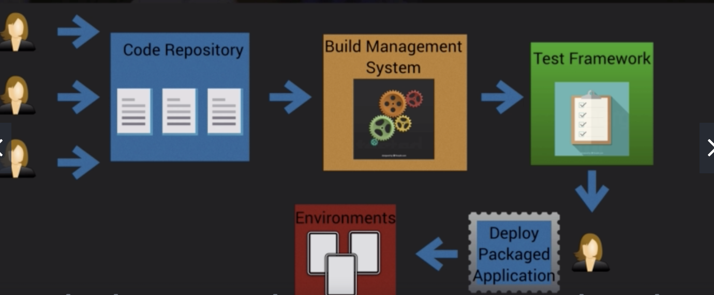
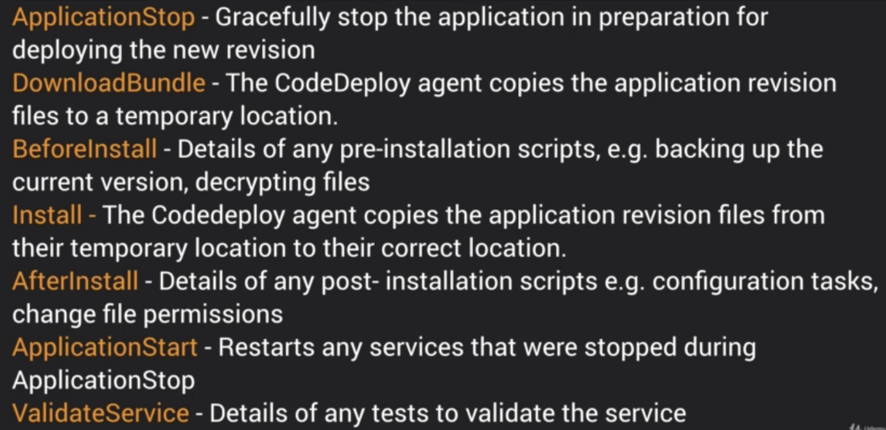

# Developer theory

## Continuous Integration & Continuous Delivery/Deployment
### CI
* Sharing the same code repository -- devs frequently push updates into shared repo
* Code repo integrated with a _build management system_
  * triggers an automated build
* Test framework runs automated tests on newly built application
* CI focuses on small code change frequently

### CD
* Continuous delivery - merged changes are automatically built, tested and prepared for release into staging and eventually production environments
* usually a manual decision process to initiate deployment of the new code

* Continuous deployment - automatically deploys new code following successful testing, eliminating any manual steps
* small changes released early and frequently

### AWS tools
* **CodeCommit**: based on Git - managed source control service enabling you to create own private git repo within AWS

* **CodeBuild**: fully managed build service - compiles source code, runs basic tests, create software packages that are ready to deploy into your environment, also provide codeDeploy

* **CodeDeploy**: automated application deploy service - can deploy to ec2 instances, on premises systems, and lambda
* Two deployment approaches available
  * _In place_
    - application is stopped on each instance and the latest revision installed
    - the instance is out of service during this time and your capacity will be reduced
    - if instances are behind a load balancer, you can configure the load balancer to stop sending requests to the instances which are being upgraded
    - AKA Rolling Update
    - if you need to roll back your changes, the previous version of the application will need to be redeployed
    - can only be used for EC2 and on-premises sytems - not supported for lambda
  * _Blue/Green_
    - new instances are provisioned and the latest revisioin is installed on all the new instances (blue is represents active deployment, green is the new release)
    - new instances are registered with an elastic load balancer, traffic is then routed to the new instances and original instances are terminated
    - advantages are that new instances can be created ahead of time and the code released to production by simply switching all traffic to the new servers. Also switching back to original environment is faster
* Terminology
  * _Deployment group_:a set of EC2 instances or lambda functions to which a new revision of the software is to be deployed
  * _deployment_: the process and components used to apply a new revision
  * _deployment configuration_: a set of deployment rules as well as success/failure conditions used during a deployment
  * _appspec file_: defines the deployment actions you want CodeDeploy to execute
  * _revision_: everything needed to deploy the new version: Appspec file, application files, executables, config Files
  * _application_: unique identifier for the application you want to deploy. Used to ensure the correct combination of revision, deployment configuration and deployment group are referenced during a deployment

* **CodePipeline**: continuous deployment service - automates your end-to-end software release process based on a user defined workflow
* Integrates with CodeCommit, CodeBuild, CodeDeploy, Lambda, Elastic Beanstalk, CloudFormation, Elastic Container Service and third party tools like GitHub and Jenkins

## Advanced CodeDeploy - The AppSpec File
* Appspec file - used to define the parameters that will be used for CodeDeploy deployment
* Lambda deployments:
  * appspec file written in YAML or JSON
  * contains the following fields:
    - _version_: reserved for future use - currently the only allowed value is 0.0
    - _resources_: the name and properties (alias, current version, target version) of the lambda function to deploy
    - _hooks_: specifies lambda functions to run at set points in the deployment lifecycle to validate the deployment
  * The following hooks are available for use:
    - _BeforeAllowTraffic_: used to specify the tasks or functions you want to run before traffic is routed to the newly deployed Lambda function (ex. test to validate that the function has been deployed correctly)
    - _AfterAllowTraffic_: used to specify the tasks or functions you want to run after the traffic has been routed to the newly deployed lambda function (ex. test to validate that the function is accepting traffic correctly and behaving as expected)
* EC2 deployments
  * written in YAML
  * contains:
    - _version_
    - _os_: the OS version you are using
    - _files_: the location of any application files that need to be copied and where they should be copied to
    - _hooks_: lifecycle event hooks that allow you to specify scripts that need to run at set points in the deployment lifecycle
  * appspec.yml must be placed in the root directory of your revision
  * run order of hooks:
    * _BeforeBlockTraffic_: run tasks on instances before they are deregistered from a load balancer
    * _BlockTraffic_: Deregister instances from a load balancer
    * _AfterBlockTraffic_: run tasks on instances after they are deregistered from a load balancer
    * steps you need to do when upgrading application
    
    * _BeforeAllowTraffic_: run tasks on instances before they are registered with a load balancer
    * _AllowTraffic_: register instances with a load balancer
    * _AfterAllowTraffic_: run tasks on instances after they are registered with a load balancer

## Docker
* Docker: an open source technology which allows you to create applications based on either linux or windows containers
* Container: a lightweight standalone executable software package which includes everything the software needs to run
* AWS provides **Elastic container service** as a fully managed clustered platform which allows you to run your Docker images in the cloud

## CloudFormation
* a service that allows you to manage, configure and provision your AWS infrastructure as code
* upload template to CloudFormation using S3
* CloudFormation reads the template and makes the appropriate API calls to create the resources you have defined in your template. Resulting resources called a **stack**
* supports YAML or JSON

### Benefits
* infrastructure is provisioned correctly with fewer mistakes
* less time and effort than configuring things manually
* can version control and peer review your templates
* free to use (charged for what you create)
* can be used to manage updates and dependencies
* can be used to rollback and delete stack

### Template structure
* AWSTemplateFormatVersion - only available version is 2010-09-09
* Description
* Metadata
* Parameters - input custom values
* Conditions - test a condition and take action based on outcome
* Mappings - set values based on a region
* Transform - include snippets of code outside the main template
  - used to reference additional code stored in S3, allowing for code re-use
* Resources - where you define the resources that you want CloudFormation to deploy for you
  - the only mandatory section of the CloudFormation template

## Serverless Application Model
* An extension to CloudFormation used to define serverless applications
* Gives you simplified syntax for defining serverless resources
* Use the SAM CLI to package your deployment code, upload it to S3 and deploy your serverless application

### CLI commands
* `sam package`
  - packages your application and uploads to S3
  - takes a YAML template as its input, outputs a SAM compatible template, uploads a deployment package to an S3 bucket that you specify
* `sam deploy`
  - deploys your serverless app using CloudFormation
  - takes sam template as input, specifies name of stack, capabilities (enables cloudFormation to create IAM role)

## Nested Stacks
* stacks that create other stacks
* allow re-use of CloudFormation code for common use cases
* create a standard template that you can reference from another template
* declared in resources section of template
  - `Type: AWS::CloudFormation::Stack`
  - `Properties`
    - `NotificationARNs`
  - `Parameters`
  - `Tags`
  - `TemplateURL`
    - URL of template which specifies the nested stack you want to create. Must be a file located in S3 bucket
    - only mandatory section
  - `TimeoutInMinutes`
    - time that CloudFormation will wait for the nested stack to complete. Default is no timeout

## Quiz
**You want to recieve an email whenever a user pushes code to your CodeCommit repository, how can you configure this?**
Configure notifications in the console, this will create a CloudWatch Events rule to send a notification to an SNS topic which will trigger an email to be sent to the user
